# 1701QCA Final project journal: *Owen Junior Kose*

<!--- As for other assessments, fill out the following journal sections with information relevant to your project. --->

<!--- Markdown reference: https://guides.github.com/features/mastering-markdown/ --->

## Related projects ##
<!--- Find about 6 related projects to the project you choose. A project might be related through  function, technology, materials, fabrication, concept, or code. Don't forget to place an image of the related project in the appropriate folder and insert the filename in the appropriate places below. Copy the markdown block of code below for each project you are showing. --->

### *Natural Disaster Sensor* ###

<!--- Modify code to insert image of related project below --->
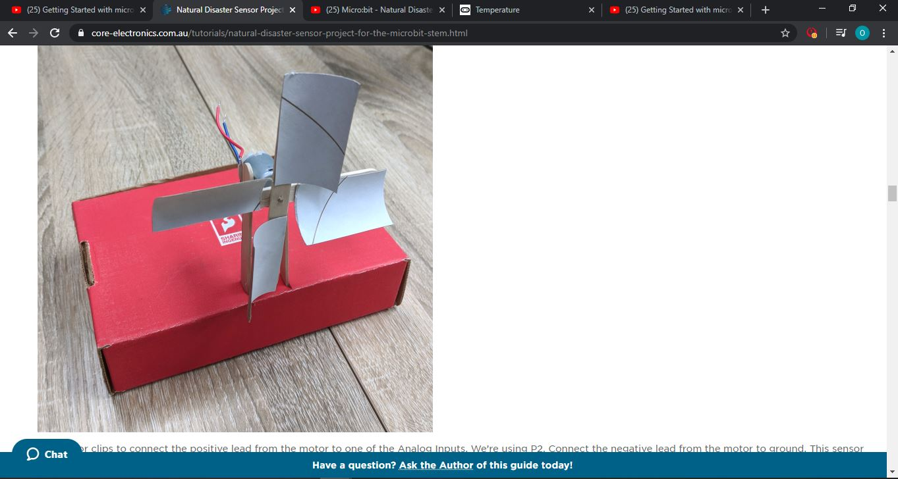

<!--- Fill out name and link to related project in the code below. --->
[Natural Disaster Sensor](https://core-electronics.com.au/tutorials/natural-disaster-sensor-project-for-the-microbit-stem.html)

<!--- Include information about why this project is related to yours. --->
*This project is similar to mine as to it uses a sensor and motor. Also the type of design is similar to what I have created for my project.*
<!--- Repeat code above for a total of 6 related projects --->

### *Automatic Car Air Freshener* ###

<!--- Modify code to insert image of related project below --->
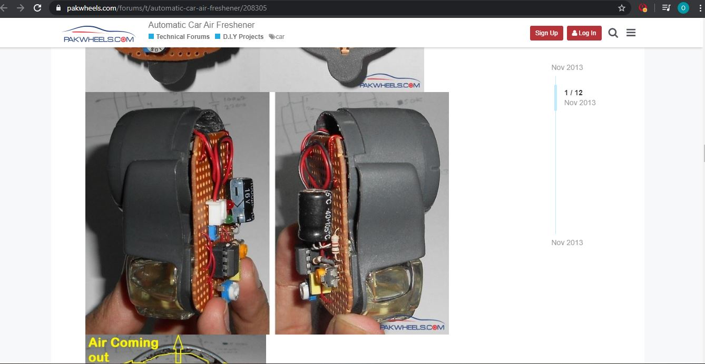

<!--- Fill out name and link to related project in the code below. --->
[Automatic Car Air Freshener](https://www.pakwheels.com/forums/t/automatic-car-air-freshener/208305)

<!--- Include information about why this project is related to yours. --->
*I would say the concept of this is related to my project as it uses a motor drive and fan to function the air freshener where as mine will be splashing water.*
<!--- Repeat code above for a total of 6 related projects --->

### *Temperature Sensor - Microbit* ###

<!--- Modify code to insert image of related project below --->
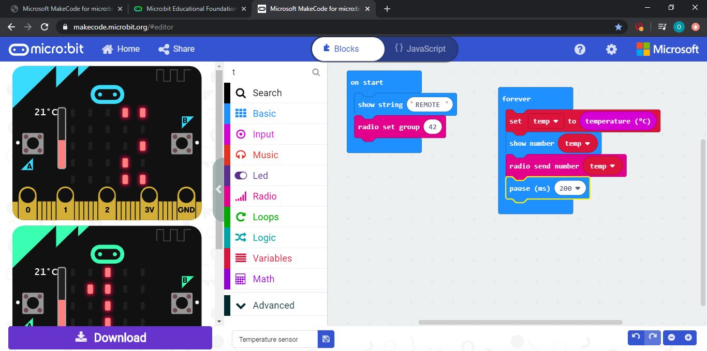

<!--- Fill out name and link to related project in the code below. --->
[Temperature Sensor Microbit](https://makecode.microbit.org/reference/input/temperature)

<!--- Include information about why this project is related to yours. --->
*This project is related to mine as I used the code from this to code my temperature sensor for my water spray.*
<!--- Repeat code above for a total of 6 related projects --->

### *Temperature Gauge* ###

<!--- Modify code to insert image of related project below --->
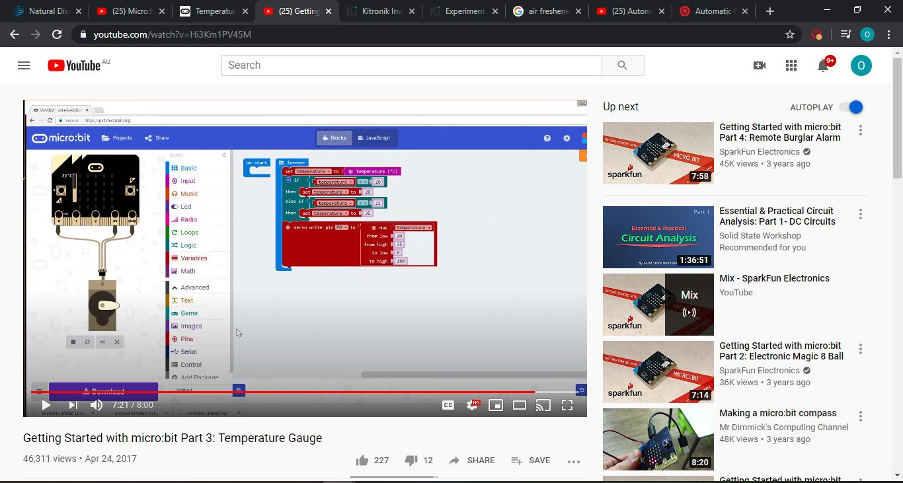

<!--- Fill out name and link to related project in the code below. --->
[Temperature Gauge](https://www.youtube.com/watch?v=Hi3Km1PV45M)

<!--- Include information about why this project is related to yours. --->
*The concept of this is similar to mine where there is a gauge is driven by  microbit and used to detect temperature. as the temperature goes up the gauge rotates and that similar to mine, however a motor/pump will be used to spray or splash water onces at a certain high temperature.*
<!--- Repeat code above for a total of 6 related projects --->

### *Drive Motor - Kitroniks Book* ###

<!--- Modify code to insert image of related project below --->
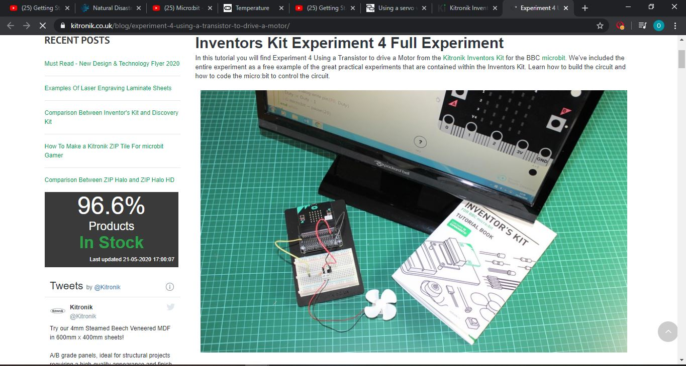

<!--- Fill out name and link to related project in the code below. --->
[Drive Motor](https://www.kitronik.co.uk/blog/experiment-4-using-a-transistor-to-drive-a-motor/)

<!--- Include information about why this project is related to yours. --->
*For this I have used the code from this to power up my motor. The code in this tells the motor to switch on to full power after a few seconds and then switches off then repeats the process again. However I altered the coded from that to start the motor when it reaches a high temperature.*
<!--- Repeat code above for a total of 6 related projects --->

### *Automatic Watering System* ###

<!--- Modify code to insert image of related project below --->
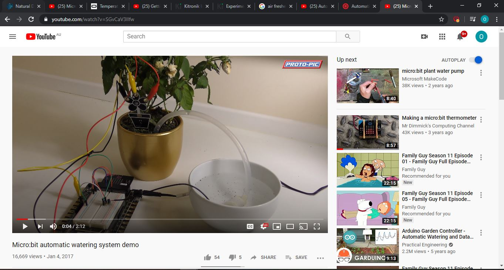

<!--- Fill out name and link to related project in the code below. --->
[Automatic Watering System](https://www.youtube.com/watch?v=SGvCaV3lIfw)

<!--- Include information about why this project is related to yours. --->
*This is related to my project, as my intended idea was to use a water pump to spray water. With this project it pumps out water when the soil is not wet, whereas mine will do something similar to that but with raise in temperature, the water pump will spay water.*
<!--- Repeat code above for a total of 6 related projects --->

## Other research ##
<!--- Include here any other relevant research you have done. This might include identifying readings, tutorials, videos, technical documents, or other resources that have been helpful. For each particular source, add a comment or two about why it is relevant or what you have taken from it. You should include a reference or link to each of these resources. --->

## Conceptual development ##

### Design intent ###
*My Design intent is to create a wristband for people wear while they are out exercising. The product it be a temperature sensor spray with sprays out water when it reaches high temperatures to keep you fresh and hydrated.*
<!--- Include your design intent here. It should be about a 10 word phrase/sentence. --->

### Design ideation ###
<!--- Document your ideation process. This will include the design concepts presented for assessment 2. You can copy and paste that information here. --->
### Concepts ###

### Concept 1 ###
*First concept was to use the microbit to create a timer that times your exercise and it also displays codes/numbers that represent a workout activity.* 

### Concept 2 ###
*Using a motor with a propeller as a windmill, it can measure the windspeed. In doing so the microbit and determine a workout routine with the windspeed reading from the windmill.* 

### Concept 3 ###
*My concept is to create a wristband that has a temperature sensor and whenever its hot it beeps to alert you then shoots out water like a mini water gun to drink or spray your face. Numbers will be used to display the temperature and LED lights on the microbit will display a straign line for it to shoot or lights are spaced out to show it spraying, so that there are two options to choose from.* 
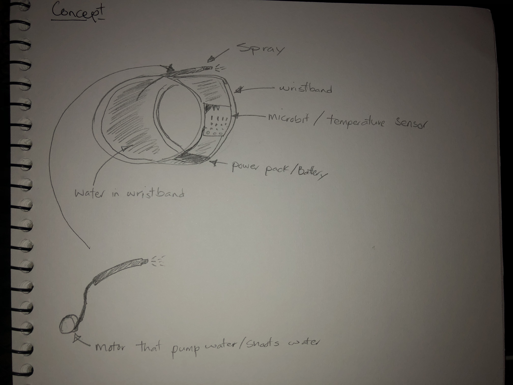

### Concept 4 ###
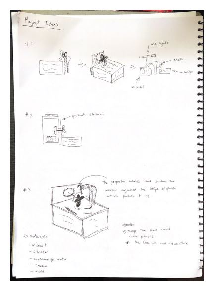

### Final design concept ###
<!--- This should be a description of your concept including its context, motivation, or other relevant information you used to decide on this concept. --->
*My final concept was to create a temperature sensor that splashes water. I was not able to get a water pump, in doing so I used a motor with a propeller to splash water when there is a raise in temperature or its hot.*
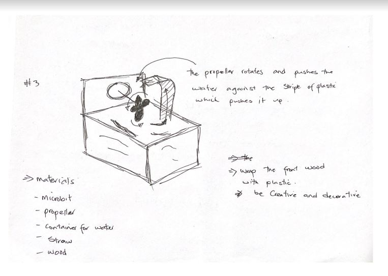

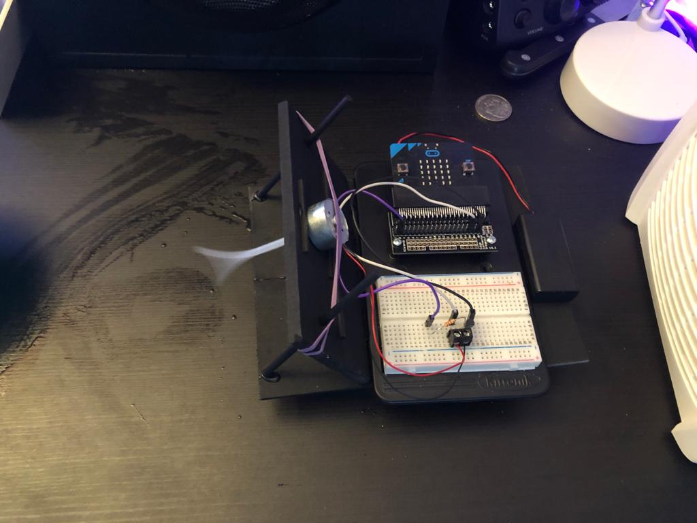

### Interaction flowchart ###
<!--- Include an interaction flowchart of the interaction process in your project. Make sure you think about all the stages of interaction step-by-step. Also make sure that you consider actions a user might take that aren't what you intend in an ideal use case. Insert an image of it below. It might just be a photo of a hand-drawn sketch, not a carefully drawn digital diagram. It just needs to be legible. --->

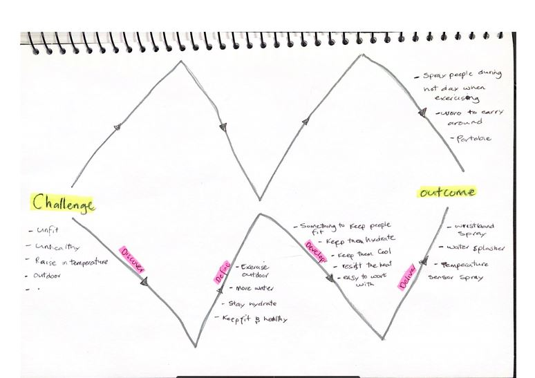

## Process documentation ##

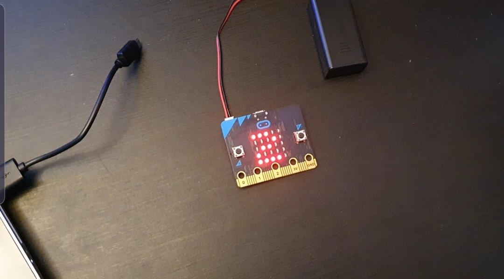

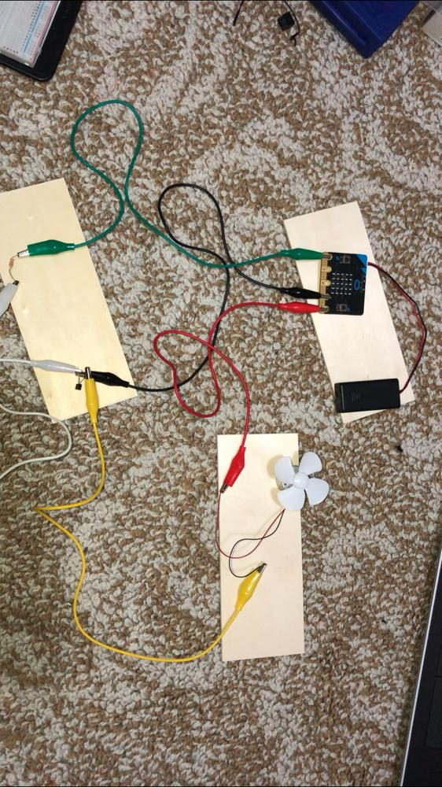

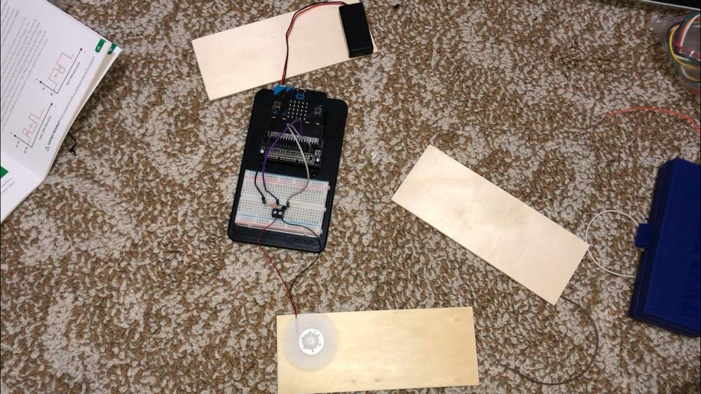

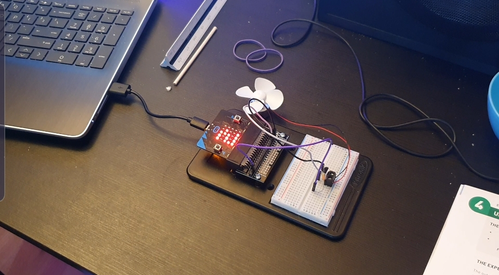

*The images above show the process of how I created my final project. I started of testing small projects and built from that up. When doing your small projects it helped me to understand a mircobit, how it can be used, how it can be coded and used on a circuit board. With the help of those projects was was able to take ideas from and code and build my final project.*

<!--- In this section, include text and images (and potentially links to video) that represent the development of your project including sources you've found (URLs and written references), choices you've made, sketches you've done, iterations completed, materials you've investigated, and code samples. Use the markdown reference for help in formatting the material.

This should have quite a lot of information! It will likely include most of the process documentation from assessment 2 which can be copied and pasted here.

Use subheadings to structure this information. See https://guides.github.com/features/mastering-markdown/ for details of how to insert subheadings.

There will likely by a dozen or so images of the project under construction. The images should help explain why you've made the choices you've made as well as what you have done. --->

## Final code ##
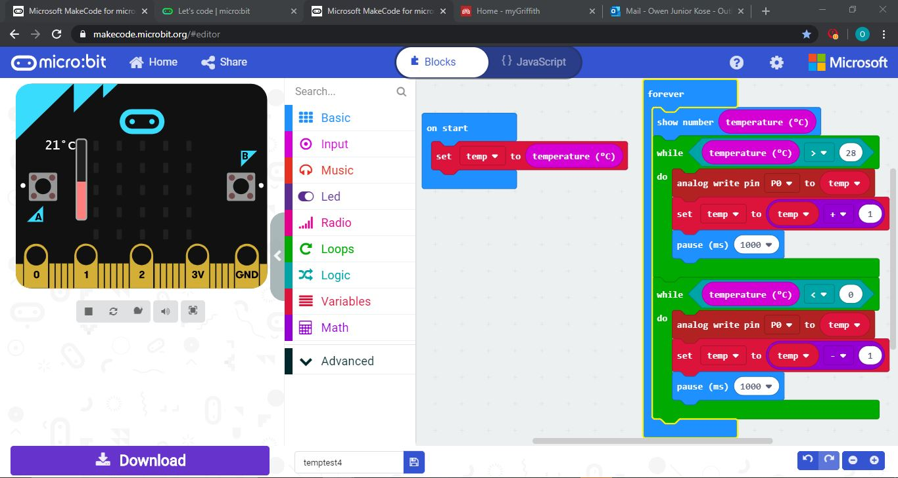

<!--- Include here screenshots of the final code you used in the project if it is done with block coding. If you have used javascript, micropython, C, or other code, include it as text formatted as code using a series of three backticks ` before and after the code block. See https://guides.github.com/features/mastering-markdown/ for more information about that formatting. --->

## Design process discussion ##
*At the beginning of this project, there was brainstorming down to get an idea for a project that can interact with people and also salve a problem. After the brainstorming, I decided to go with the idea exercise. I saw this as an opportunity to going into as people are now out and running to exercise or are training outside in the backyard. In doing so my idea was to create a wristband that sprays water out when the temperature raises to a high hot temperature, however during the design process, I was not able to get a water pump for this project. In doing so I improvised and used a motor to splash water onto a person but the only problem was it would be too big to fit on a wrist, therefore I created one that can is placed on the desk inside of a home and when ever its hot inside, it splashes water. This can be further improved if I get a water pump and can replace the motor with the pump and be eassily built to a wrist band spray.*
<!--- Discuss your process used in this project, particularly with reference to aspects of the Double Diamond design methodology or other relevant design process. --->

## Reflection ##
*The most important thing I have found was the coding and designs of the related projects as it helped me to get the final outcome of the project. They helped me understand the code and also pointed me in the direction of my design. Also the wiring of the microbit was interesting as it was a bit confusing. One thing I would improve is replacing the motor with a water pump to create the water spray and it would also help to design the wristband easily. Through this project, everything has been new to me as it was my first time coding a microbit and wiring it. The coding part was the most interesting thing to me as I Did not know you could do a lot with code when coding a microbit. Coding the temperature sensor and motor to the microbit was also new to me as I thought that we could code one thing at a time on a microbit. An extension of this project would be make it into a wristband with a water pump for people wear and exercise, it can be made into a wristband or maybe into strap that you can wear on your torso like a vest. Or maybe something out of this world where, when are you bored doing work and try to fall asleep, the microbit will sense that and spray water in your face to wake you up. Maybe using the microbit to measure your pulse and tell if youre active or falling asleep but maybe something along those lines.*

<!--- Describe the parts of your project you felt were most successful and the parts that could have done with improvement, whether in terms of outcome, process, or understanding.

What techniques, approaches, skills, or information did you find useful from other sources (such as the related projects you identified earlier)?

What parts of your project do you feel are novel? This is IMPORTANT to help justify a key component of the assessment rubric.

What might be an interesting extension of this project? In what other contexts might this project be used? --->
